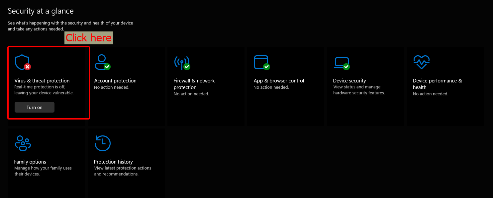
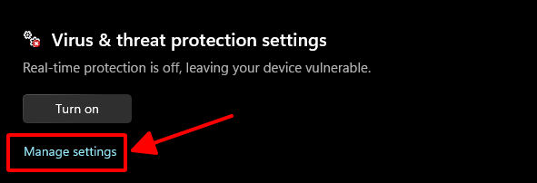
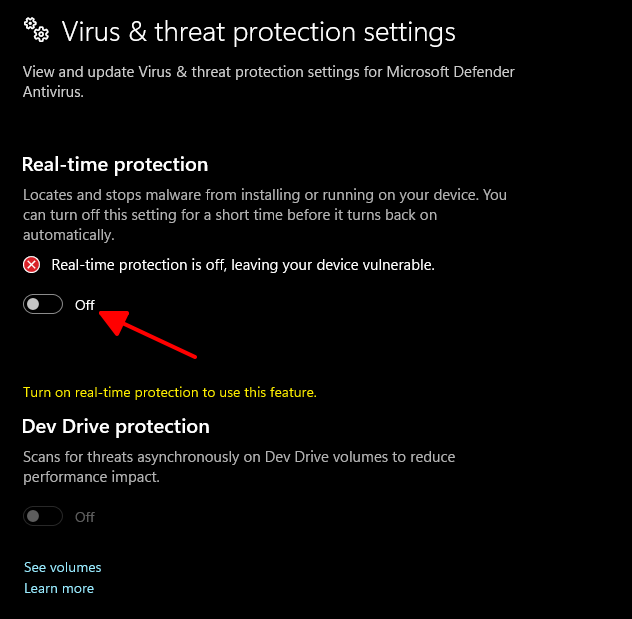
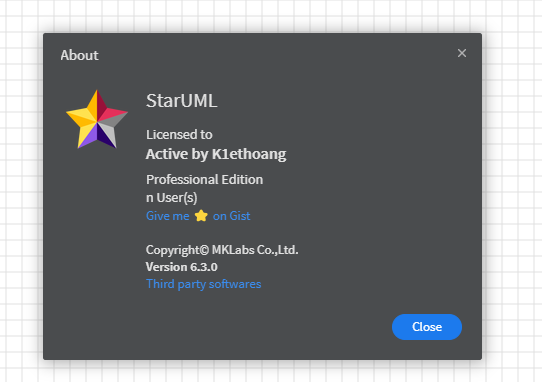

# ✅ HƯỚNG DẪN CÀI ĐẶT & ACTIVE STARUML VERSION 6 ON WINDOWS / MACOS / LINUX

    
    
    
    
    

## StarUML là gì?

- **StarUML** là một công cụ kỹ thuật phần mềm để mô hình hóa hệ thống sử dụng Ngôn ngữ mô hình hóa thống nhất, cũng như Ngôn ngữ mô hình hóa hệ thống và các ký hiệu mô hình hóa cổ điển. Nó được xuất bản bởi MKLabs và có sẵn trên Windows, Linux và MacOS.

---

## Cài đặt StarUML như thế nào?

- Cài đặt với đường dẫn sau: [▶️ StarUML](https://staruml.io/)

---

## Active StarUML như thế nào?

- Như chúng ta đã biết trên chính trang chủ của https://staruml.io/ cho phép sử dụng miễn phí trong vòng 30 ngày.
- Thế nhưng vẫn có cách để active ứng dụng **StarUML** và sử dụng vĩnh viễn, nói một cách đời thường hơn thì việc chúng ta active ứng dụng nào đó mà không phải mua bản quyền được gọi là `crack` hoặc `thuốc`.

---

## Các bước thực hiện active StarUML

1. Tải và cài đặt StarUML: [▶️ StarUML](https://staruml.io/)
2. Tải file `app.asar` trên **google drive** từ liên kết sau: [🔗 app.asar](https://drive.google.com/file/d/1_sKvHVL6SebnYF73iZxSWD9l48Pddzvj/view?usp=sharing)
3. Thực hiện tắt tường lửa (nếu tải file không bị lỗi có thể bỏ qua bước này):

    - Truy cập vào `Windows Security` trên Win.
    

    - Ấn vào `Virus & Threat Protection`.
    

    - Bỏ chọn `Real-time protection`.
    

4. Thực hiện copy file `app.asar` đã được tải từ bước 2 ghi đè file `app.asar` đã có trong resources của StarUML.
    - Window: `C:\Program Files\StarUML\resources`
    - MacOS: `/Applications/StarUML.app/Contents/Resources/`
    - Linux: `/opt/StartUML/resources`

    - **LƯU Ý:** Các đường dẫn trên không nên copy mà nên tự duyệt từ `File Explorer`.

---

## Hoàn thành cài đặt và active StarUML

- © Được soạn thảo bởi: [huynhkhuanit](https://github.com/huynhkhuanit)
- © Nội dung `active` được thực hiện bởi: [K1ethoang](https://gist.github.com/K1ethoang).